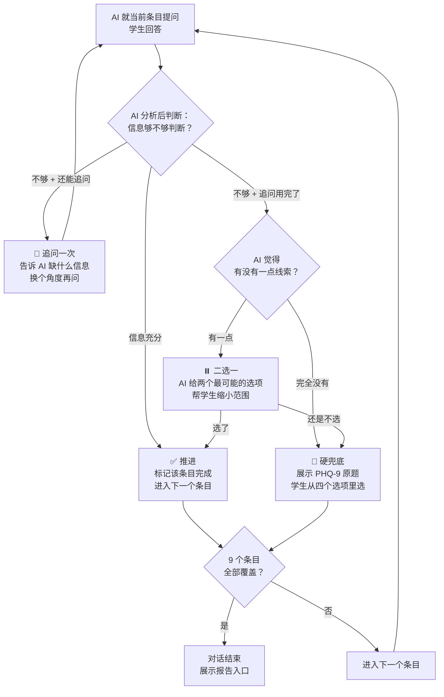
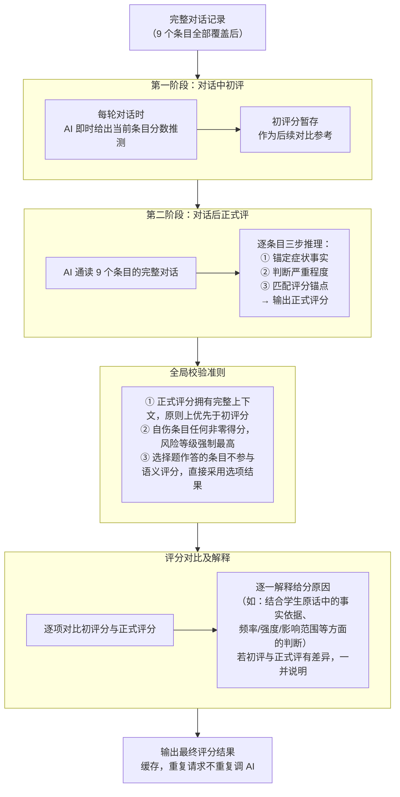

# AI筛查 — 业务拆解文档3

> **版本**：v3.0 | **日期**：2026-07-22 | **类型**：业务分析文档
> **阅读对象**：产品经理、开发工程师

---

## 一、研究现状

### 1.1 LLM 心理评估的核心研究结论

基于近年学术研究，LLM 驱动的对话式心理评估在成人群体中已形成较为充分的证据链。


| 层次            | 核心发现                                                                                                                           | 代表研究                                         |
| ------------- | ------------------------------------------------------------------------------------------------------------------------------ | -------------------------------------------- |
| 对话施测可复现量表分数   | PHQ-9 对话评分与自评的 ICC = 0.92，心理测量属性优良（Cronbach's α = 0.81，灵敏度 96%，特异度 90%）                                                        | HopeBot（UCL/NHS，2025）、Perla（Madrid，2020）     |
| AI 对话评分可能优于自评 | AI 对话评分的灵敏度（89.3% vs 71.4%）和临床一致性（κ = 0.72 vs 0.55）均优于自评 PHQ-9；去除自适应追问后 Kappa 从 0.798 降至 0.472                                 | BDI-FS-GPT（JMIR，2026）、AgentMental（AAAI，2026） |
| 用户接受度优于传统方式   | 70.7% 更信任 AI 评分，触达率是传统表单的 2.5 倍以上，满意度显著优于传统量表；青少年（10-19 岁）重复交谈意愿与真人医生无显著差异；报告了可接受的内容效度、用户可行性和临床效用，可作为扩大青少年心理健康评估可及性的补充性第一步骤工具 | HopeBot、Perla、medRxiv RCT、平板聊天机器人研究          |


**关键洞察**：对话式施测不仅能复现量表结果，还有可能通过自适应追问获取更高质量信息——受试者在自然对话中暴露的信息比在量表选项中愿意承认的更接近真实状态。

### 1.2 关键短板

南开大学 UbiComp 研究邀请 11 位心理健康专业人士评估，一致指出三个短板：


| 短板         | 具体表现            |
| ---------- | --------------- |
| **共情能力不足** | 回应生硬、对间接痛苦表达识别差 |
| **智能评估缺陷** | 无法准确理解口语化心理表达   |
| **危机干预缺失** | 检测到风险后缺乏有效处置链路  |


### 1.3 K-12 场景的研究空白与风险

现有研究几乎全部聚焦成人群体，在 K-12 场景中存在系统性空白：


| 风险维度     | 学术研究场景         | 学校实际场景                    |
| -------- | -------------- | ------------------------- |
| **参与者**  | 成人为主，语言表达成熟    | 6-18 岁，表达清晰度差异大           |
| **参与动机** | 自愿报名，有报酬或好奇心   | 学校组织，可能有"被安排"感，敷衍回答比例可能更高 |
| **语言**   | 英语/西语为主        | 中文心理表达的文化差异未经验证           |
| **后果感知** | 研究用途，作答真实性可能更高 | 学生担心"被贴标签"，社会赞许性偏差可能更高    |


**结论**：对话式筛查在 K-12 群体中的有效性**目前完全无数据**支撑。

---


## 二、业务拆解


### 2.1 用户分析


| 传统量表                          | AI 筛查                | 对学生                 | 对老师                        |
| ----------------------------- | -------------------- | ------------------- | -------------------------- |
| 条目固定，容易引发练习效应                 | 对话自然流动，每次不同，无法"背答案"  | 像聊天而非考试，减少枯燥和重复感    | 作答质量不受重复施测侵蚀               |
| 题目直接呈现敏感词汇"沮丧、绝望"等，易引发焦虑和防御心理 | 以好奇和陪伴的姿态自然提问，不贴标签   | 降低自我判断焦虑和防御心理       | 学生更可能真实作答，而非"选看起来正常的"      |
| 缺乏互动与澄清机会，学生可能不理解条目含义         | 动态追问，自然澄清模糊回答        | 不需要在选项间纠结，只需自然表达    | 减少因理解偏差导致的无效数据             |
| 局限于统一选项，无法表达个体化困扰             | 自然语言承载时间线、情境、因果关系    | 能表达具体困扰及其背后的动机和情境   | 可提取丰富信息用于分层和面谈准备，完整对话记录可追溯 |
| 机械条目，无互动，易敷衍作答                | 语义一致性判断，从自然表达中推测真实状态 | 面对 AI 更少社会性压力，更愿意袒露 | 筛查结果更可信，降低假阴性风险            |


### 2.2 业务定位与产品边界


#### 完整链路：

```
筛查（识别风险） → 复核（确认问题） → 干预（提供支持）
```

AI ：不确定性、概率性风险。复核和干预的最终判断和责任必须落到人身上。


| 环节     | AI 能力           | AI 风险                        | 结论           |
| ------ | --------------- | ---------------------------- | ------------ |
| **筛查** | 标准化访谈、信息收集、初步评分 | 可能误判，但后果可控（复核环节纠正）           | **适合 AI**    |
| **复核** | 可提供对话摘要和评分依据    | 无法替代专业判断——对模糊信息、非语言线索、动机判断不足 | **人做决策**     |
| **干预** | 可提供一般性建议和资源引导   | 错误建议可能造成伤害；共情不足无法处理深层情绪；法律责任 | **人主导，AI辅助** |


#### 产品定位：验证 AI 筛查与传统量表准确性相当后，替代传统量表评估方式，或者提供多一种筛查方式选择。


### 2.3 产品设计的三个核心挑战

**挑战一：评估准确性** 


| 保障维度  | 策略                                        |
| ----- | ----------------------------------------- |
| 施测一致性 | AI 对话需覆盖 PHQ-9 全部 9 个维度，语义理解锚定标准化评分锚点     |
| 信息充分性 | 对话无法获取足够信息时，需有兜底机制确保零信息丢失，避免"没问到=没问题"的假阴性 |
| 决策可靠性 | 安全相关决策（推进/追问/兜底/风险响应）不应依赖模型自主判断，需由确定性规则把控 |
| 结果可验证 | 评分过程可追溯——每个条目的分数需有对话依据支撑，兜底得分与对话得分明确区分    |


**挑战二：产品边界**


| 边界维度         | 策略                                       |
| ------------ | ---------------------------------------- |
| 专业 vs 体验     | 交互体验与测量逻辑解耦——前端是自然的聊天，后端是严谨的评估；两者互不干扰    |
| 对话范围 vs 深度   | 在有限对话轮次内获取最大信息量——追问有节制，覆盖有节奏，避免在某一条目过度纠缠 |
| 危机判断 vs 风险处置 | 不漏判是底线，不过度响应是体验——风险信号分级响应，处置方式融入对话而非打断对话 |


**挑战三：K-12 场景适配** 


| 适配维度  | 策略                                         |
| ----- | ------------------------------------------ |
| 语言与认知 | 适配不同年龄段学生的表达能力和理解水平——问题要能被听懂，回答要能被正确解读     |
| 心理防御  | 用去病理化的交互降低学生的防御和污名感——学生感受到的是"聊天"而非"评估"     |
| 角色信任  | AI 角色的亲和力与可信度直接影响学生袒露意愿——角色形象需有温度、不评判、值得信任 |


### 2.4 实施验证方案

通过试点验证：同一批学生同时完成 AI 对话筛查和传统 PHQ-9 量表，对比评估准确性（ICC ≥ 0.85）与安全性（零漏判）。

---


## 三、模拟实践效果（COSMO 现状）


### 3.1 项目概述

**COSMO** — 学生心理健康状态评估对话系统。基于 Next.js 14 + DeepSeek API，已搭建完整的"对话→评分→报告"三引擎 Demo。会话数据临时存放在服务内存中，服务重启后丢失。

### 3.2 整体架构

系统分三层协作：

```
前端（页面）          后端（业务）           外部（AI）
─────────────────────────────────────────────────────
  首页   ──────────→  创建会话
    │
  对话页  ──────────→  对话引擎              DeepSeek API
    │                  · AI 分析（语义理解）       ↑
    │                  · 代码层决策（推进/追问/兜底）  │
    │                  · 风险检测 + 内容过滤       │
    │                                            │
  报告页  ──────────→  评分引擎 ─────────────────┘
                       · 两阶段 + 全局校准
                      
                      报告引擎 ─────────────────┘
                       · 个性化反馈生成
```

**核心设计原则**：AI 负责理解学生说了什么，代码层根据 AI 的判断决定下一步——推进、追问、还是兜底。

#### 3.2.1 对话引擎：AI 分析 + 代码层决策分离

对话生命周期：**破冰（2 轮轻松闲聊）→ 逐一访谈 9 个维度 → 全部覆盖后收尾**。

每个条目 AI 先提问，学生回答后 AI 输出一个结构化分析，告知：信息够不够判断、分数大概多少、有没有高风险。代码层按以下规则做最终决策：




**为什么不让 AI 自己决定？** AI 擅长理解语义，但可能产生幻觉。把决策权交给代码层的确定规则，能确保推进/兜底/风险响应等安全判断不受模型幻觉影响。

**兜底的三层递进**：追问（再给一次表达机会）→ 二选一（缩小范围）→ 硬兜底（选择题）。保证对话获取不了的信息不会变成"没问到＝没问题"的假阴性。

**风险处置融入对话**：关键词实时检测 → AI 温和确认意图（不弹窗）→ 确认后触发自伤条目 + 3 轮情绪缓和。全程不让学生感到"被系统标记了"。

#### 3.2.2 评分引擎：两阶段 + 全局校准




**为什么两阶段？** 逐项初评时 AI 只看到当前条目对话。比如学生在"兴趣"上说"还行"，但到"自我感觉"时透露"什么都不想做"——正式评拥有完整 9 条目视角。评分对比及解释逐项说明给分依据，初评与正式评有差异时一并解释原因。**正式评分始终是最终答案**。

#### 3.2.3 报告引擎

根据评分结果生成个性化反馈，三个模块：

- **凝练句**（10-15 字）：一句话概括当前状态，落点在学生已有的力量而非问题
- **状态分析**（三层递进）：看见正在经历的 → 理解这些感受的逻辑 → 发现已有的韧性
- **分层建议**：四档风险等级给出差异化建议方向，高风险等级融入心理援助热线

全程禁止展示分数、等级标签、病理化词汇。

#### 3.2.4 安全链路：双层防护


| 防护层      | 位置  | 机制                                    | 作用       |
| -------- | --- | ------------------------------------- | -------- |
| **风险检测** | 前置  | 关键词 + 句式匹配，三类风险（自杀意念 / 自伤 / 极度绝望）实时识别 | 不漏判高风险信号 |
| **内容过滤** | 后置  | AI 回复生成后，移除含"抑郁""焦虑""障碍"等病理化词汇的句子     | 确保输出不贴标签 |


### 3.3 关键设计决策


| 决策              | 核心理由                           |
| --------------- | ------------------------------ |
| AI 判断 + 代码层决策分离 | 安全决策不容模型幻觉——推进/兜底/风险响应由确定性规则把控 |
| 对话兜底展示量表原题      | 保证零信息丢失——对话获取不了的信息，用选择题兜底      |
| 两次评分（先逐项、后全局）   | 单条目视角可能偏差，全局视角利用跨条目线索修正        |
| 风险处置融入对话流       | K-12 场景弹窗可能让学生恐慌，改为 AI 自然对话确认  |
| 评分锚点优先于 AI 自由判断 | 锚点严格对齐 PHQ-9 量表标准，比 AI 自由打分更可靠 |


### 3.4 当前状态

**已完成**：三引擎完整架构 ✓ | 对话生命周期管理 ✓ | AI 分析 + 代码层决策分离（五条决策路径） ✓ | 硬兜底机制 ✓ | 风险检测与自然对话处置 ✓ | 安全过滤 ✓ | 两阶段评分 + 全局校准 ✓ | 报告三层递进 + 四档建议 ✓ | 回答质量标记 ✓ | 上下文感知 ✓

**测试概况**（2026-07-23，基于 4 个模拟案例的双 Agent 端到端测试）：

| 案例 | 预设分 | 实际分 | 偏差 | 评分通过 | SYS 输出率 | 等级判定 | 覆盖完整性 |
|------|:--:|:--:|:--:|:--:|:--:|:--:|:--:|
| 案例1 林晓阳（正常·1分） | 1 | 2 | +1 | ✅ | 33%（6次） | 正确 | 完整（9/9） |
| 案例2 周思语（轻度·8分） | 8 | 16 | +8 | ❌ | 17.6%（3/17轮） | 严重误判 | 完整（9/9） |
| 案例3 陈浩然（中度·13分） | 13 | 18 | +5 | ❌ | 11.1%（2/18轮） | 高估一档 | 完整（9/9） |
| 案例4 苏雨桐（重度·27分） | 27 | 21 | -6 | ❌ | ~12% （2次） | 正确 | ⚠️ 7/9（Q4/Q7未覆盖） |

**关键指标**：
- 对话完成率：4/4（100%），全部自然完成无异常退出
- 评分准确率（±2分以内）：1/4（25%）
- 评分偏差范围：-6 ~ +8，中位绝对偏差 5.5
- 评分方向：3/4 案例偏高（案例1~3），1/4 案例偏低（案例4）
- SYS 块输出率：11.1%~33%，整体偏低，平均约 18%
- 覆盖率：3/4 案例 9 条目全部覆盖
- 等级判定正确率：2/4（50%），案例2/3 各高估一档

**当前仍然存在的问题**（概述）：
1. 🔴 **评分系统性高估**：案例2（+8）、案例3（+5）均表现为锚点匹配对频率词过于敏感，将"偶尔""有时"匹配到锚点2。Q4（精力）、Q5（食欲）、Q7（注意力）、Q8（精神运动）为高估重灾区
2. 🔴 **评分低估风险**：案例4 中 Q4/Q7 因对话未覆盖被硬置0（各-3），高风险路径的深度追问挤占了其他条目的覆盖空间
3. 🟡 **SYS 块输出率持续偏低**：四案例 11%~33%，系统推进决策在多数轮次依赖代码层 fallback
4. 🟡 **Q9 风险处置链路**：案例4 中 AI 对自伤/自杀意念的处理出色但代价是"吞噬"了 Q4/Q7 的探查机会

**下一步计划**：
- 短期：评分 Prompt 增加语境限定词检测和锚点匹配严格度约束；修复高风险路径中其他条目的覆盖保障
- 中期：提升 SYS 块输出率（Prompt 结构调整 + 代码层检测重试）；追问深度从 2 轮扩展到 3 轮
- 长期：参照 AgentMental 五维追问框架和跨条目记忆关联，在保持单 LLM + 代码层决策架构的前提下提升信息收集精确性

---

> **文档说明**：本文档基于 9 篇学术文献的研究结论和 COSMO 源码编写，聚焦业务逻辑和产品架构，不涉及具体代码实现细节。

